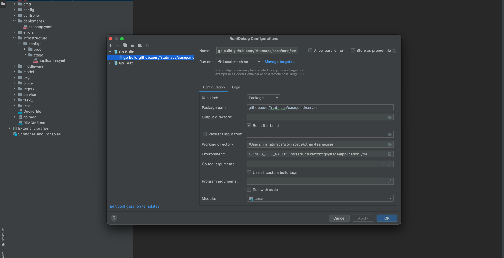

# Case Api

## About


Simply, i designed and coded an api creator, and i have applied twelve-factor app on the project.

This project was developed by Go Language.

## Usage

You can directly run /cmd/server/main.go file to use program.

```Shell
To Call a person endpoint

GET http://localhost:8080/api/v1/persons

```

## Run

You can run the project via command:

```Shell
go run main.go
```

## Docker

You can dockerize the project via command:

```Shell
docker build -t example-task .
```

You can run the project via command:
```Shell
docker run -p 8080:8080 --name example-task-app -e "CONFIG_FILE_PATH=./infrastructure/configs/stage/application.yml" example-task
```

## k8s

You can see the project deployment yaml (caseapp.yaml) under deployments folder.

```Shell
kubectl apply -f caseapp.yaml
```

## Testing

This project has integration tests in files.

You can test the code via the files.

## About me

I am Fırat Atmaca.

I have been working on software projects since 2013.

You can contact with me via [Linkedin](https://www.linkedin.com/in/firat-atmaca-469b2769/)



